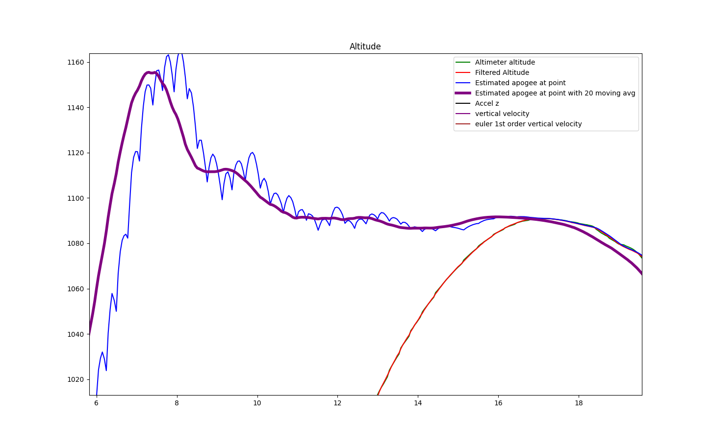

# Estimating Apogee During Ascent

These scripts are different attempts to estimate the apogee, or highest point, the rocket will reach.

We rely on the Raspberry Pi SenseHat Altimeter (Barometric Sensor).
By measuring the ambient air pressure through two holes in the side of the avionics bay, we can compare with the air pressure at the ground to estimate the altitude.

These scripts were run on data logged from launches, but they are fast enough to *potentially* run on the onboard Raspberry Pi, and the next goal would be to integrate them with the flight control loop.

## `predict.py`: Plotting Subscale Altimeters & Altitude Estimation

> Units are in feet (y-axis) and seconds (x-axis)

The spike in the SenseHat Altimeter (Blue) occurs at the apogee, which is when the other Altimeter in the other compartment detonates the ejection charge for separating the rocket and releasing the drogue parachute. This causes a pressure buildup in the lower avionics bay, where the SenseHat is. This shows up as a lower altitude estimate. At around 26 seconds, a similar spike occurs due to separating the other compartment and releasing the main chute, and the rocket decelerates towards the ground.

The horizontal yellow line is our goal for the competition. In this case, we are overshooting by hundreds of feet.

The green line is our estimated apogee using the velocity at the end of the boost phase. The model we use is a simple equation (gravitational acceleration and simple drag equation). We use mass and drag coefficients from our OpenRocket model.

The apogee estimate is over a hundred feet short of the actual apogee. Can we do better?

The velocity estimates are calculated with a first-order derivative. They are smoothed somewhat, especially the green one (used for apogee estimation). The green velocity estimate is only valid in the ballistic phase (between boost-phase and apogee)

## `predict2.py` - Live apogee prediction for Full-Scale flight

This is a plot of our Full-Scale flight data. We use the estimated velocity to refine the apogee estimate during the coast (ballistic) phase.

Side note: the code and plots are now in metric. No more slugs!

> Note: the altitude begins negative because the Altimeter data hasn't been calibrated based on ground-level air pressure. This is OK for these plots, but will have to be corrected for live use.

The altitude (and therefore velocity) data are spiky because of minimal filtering (rolling averages).

We are also using a slightly fancier integration method (4th order Runge-Kutta) to simulate the apogee using the drag equation at each timestep.

Here, we are overestimating the apogee. It's possible that our drag coefficient is off, or there is another problem with the model.

## `predict3.py` - Applying Kalman filter to Altimeter data

The altimeter data is slightly noisy, but applying longer moving averages skews and delays the data. This is bad for our live estimate.

Here, we apply a Kalman filter to smooth out the altimeter measurements. The Kalman filter uses a simple position + velocity model. It measures the varience of the altimeter measurements by comparing where it should be to where it is, and uses that to adjust how much impact each individual noisy measurement has.

We can also extract the Velocity estimate directly from the Kalman filter's model for our apogee estimation!

Zooming in on a section, we can see the smoothing in action:

Could we do more than just position + velocity for our Kalman filter? We could add Acceleration; in fact, we have accelerometer data!

Unfortunately, our accelerometer saturates at 8g during the boost phase. We can therefore only rely on it during the coast (ballistic) phase, where it could tell us some info about air drag deceleration.

## `kalman_test2.py` - Using 3rd-order Kalman filter with Accelerometer

Added a 3rd order (Altitude, Velocity, *Acceleration*) to the Kalman filter.

Of those, our sensors are:
- Altitude: Altimeter (Barometer)
- Velocity: none (estimated)
- `Acceleration`: Accelerometer

We update the `Acceleration` measurement by adding -9.81 m/s^2 to the z-axis of the accelerometer, as gravity can't be measured while ballistic.

The velocity estimated by the Kalman filter, while not directly measured, is very smooth:

Now, let's integrate this new filter with our apogee estimator!

## `kalman_test3.py` - 3rd-order Kalman filter with Live Apogee Estimate

And here it is: 

Right after burnout, the speed is estimated as too high, and the apogee estimate overshoots by 500m. This is probably because the Accelerometer saturated.

Maybe in future work, we can keep the accelerometer from saturating. The SenseHat accelerometer supports different resolution levels, from 2G to 16G. There is a tradeoff between capturing the entire range for boost phase dead-reckoning, and sensitive measurements of air drag deceleration.

Even then, we are trending higher by quite a bit. This is likely due to our OpenRocket drag coefficient being lower than the rocket that was built, which was a bit... rough around the edges. We also observed premature deployment of airbrakes due to a weak motor driver and the rocket spinning rapidly, so that could have contribtued to drag.

Still, there are about 5 seconds near the apogee where our apogee estimate gets really close (within 10m)

If our flap airbrake system had enough control authority in this zone, it might be able to potentially guide the rocket close to a target altitude. Unfortunately, control authority diminishes as speed decreases and the airbrakes produce less drag.

### Lessons learned / future ideas

- Kalman filter is useful, but need high-quality sensor data
  - Need less noisy sampling of barometer
  - Ideally, pitot tube to measure airspeed
  - Should calibrate accelerometer to avoid saturation
  - GPS? Usually not available at high speeds / G-forces for obvious reasons
- Need better model for Kalman filter and apogee estimation
  - Currently, 1-axis ("up and down") model
  - Could benefit from more sophisticated e.g. 6-axis model
  - Drag coefficient could be refined better, ideally modeled or measured at different speeds
